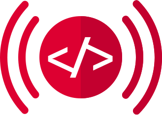

# Angular Signals JSX Starter Kit

Angular Signals JSX is fine-grained reactive JavaScript framework which uses the signals found in `@angular/core`. This implementation provides considerably better performance than pairing Angular's signals with their dirty-checking Zone.js change detection methods.

## 🧞 Commands

All commands are run from the root of the project, from a terminal:

| Command           | Action                                       |
| :---------------- | :------------------------------------------- |
| `npm i`           | Installs dependencies                        |
| `npm run dev`     | Starts local dev server at `localhost:3000`  |
| `npm run format`  | Formats all files in the project             |
| `npm run build`   | Build your production site to `./dist/`      |
| `npm run preview` | Preview your build locally, before deploying |

## 👀 Want to learn more?

Visit [the repo](https://github.com/markmals/angular-signals-jsx) and read the code!
